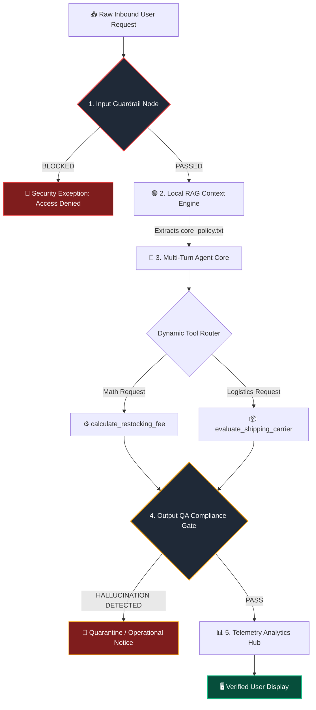

# ACME Omniscient: Self-Defending Autonomous Support & Logistics Ecosystem

A production-grade, local-first AI agent architecture built using Python and Llama 3.2. This system is designed to handle specialized e-commerce operations, deterministic financial tooling, and semantic knowledge retrieval while implementing strict input/output defensive guardrails and performance failover routing.

## 🏗️ System Architecture Topology



## 🛠️ Technical Implementation Breakdown

* **🛡️ Asymmetric Input Perimeter (Week 8):** Implements an upstream Guardrail Firewall Node that intercept text tokens to validate context strings against malicious prompt injections, system-level bypass commands, or social engineering exploits.
* **🗄️ Contextual Semantic Memory (Weeks 1-4):** Operates a localized Retrieval-Augmented Generation (RAG) data flow that extracts true reference policy statements to anchor agent output within specified operational parameters.
* **⚙️ Tool-Augmented Agent Control (Week 7):** Integrates standard natural language processing with strict, deterministic Python calculation endpoints using structural model function calling protocols.
* **🔍 Factual Output Verification Gate (Week 8):** Features a back-door Quality Assurance auditor loop that parses raw structural output data streams against original facts to detect and quarantine hallucinations before delivery.
* **📊 Performance Telemetry Tracking (Week 8):** Measures system overhead including transaction latency, token throughput speeds, and triggers a circuit-breaking **Hybrid Failover Proxy Router** if local hardware limits breach target SLAs.

## 🚀 Local Installation & Execution

1. Ensure a local instance of Ollama is running with Llama 3.2 available:
   ```bash
   ollama run llama3.2